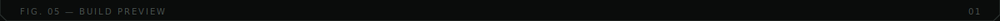
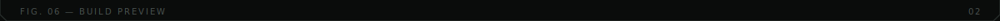
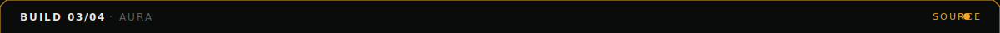
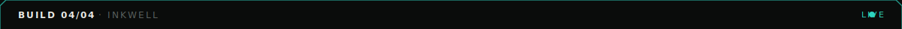
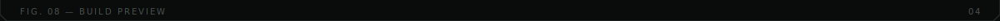
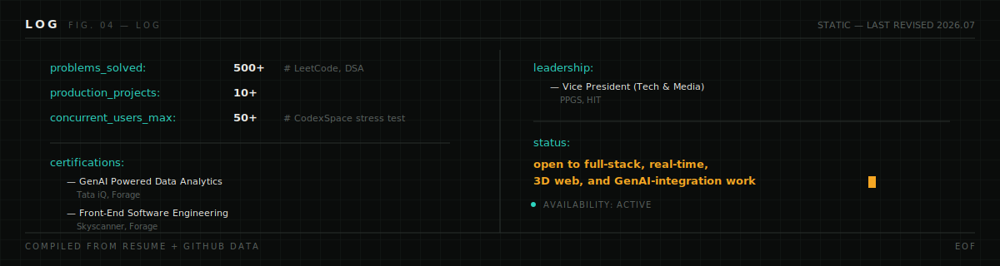

 

**Full-stack developer working at the intersection of interface, motion and systems.** I build things that are fast to use and precise to look at — real-time collaborative tools, 3D web experiences, and AI-integrated products, shipped with the same attention to detail you'd expect from a piece of hardware documentation, not a portfolio site.

[`PORTFOLIO`](https://portfolio-by-ar.vercel.app/) · [`LINKEDIN`](https://linkedin.com/in/anshu-raj-tech) · [`LEETCODE`](https://leetcode.com/u/anshxu) · [`EMAIL`](mailto:rajanshu2123@gmail.com)

## ⌁ SYSTEM STATUS

This panel is not a static badge. It's regenerated every 6 hours by a GitHub Action that pulls real commit and language data from this account and draws it from scratch — see <code>.github/workflows/generate-readout.yml</code>.

## ⌁ SCHEMATIC

## ⌁ BUILDS

**PHOENIX** — last-minute crisis tool for exams, interviews, deadlines and hackathons.

A 6-agent AI pipeline diagnoses what's actually critical, cuts non-essential material, and outputs an hour-by-hour recovery plan with weighted survival odds — self-correcting via an auto-chaining loop that re-triages at higher strictness if simulated success odds fall below 60%.

`React` `TypeScript` `Gemini` `Three.js` `GSAP` · [Source](https://github.com/anshu-c8NETed) · [Live](https://phoenix-647479600848.us-west1.run.app/)

 

**CODEXSPACE** — real-time collaborative code editor with embedded AI.

Built for 50+ concurrent users at sub-100ms edit latency, with in-browser code execution via WebContainers and a Monaco-powered editing surface that feels native, not bolted-on.

`React` `Socket.io` `Gemini` `MongoDB` · [Source](https://github.com/anshu-c8NETed) · [Live](https://codex-space-frontend.vercel.app/)

 

**AURA** — editorial e-commerce concept for an evening-wear label.

WebGL displacement-map shader transitions in the hero, scroll-driven text scramble, and a keyword-triggered photo-burst reveal — built to read like a fashion magazine spread, not a product grid.

`React` `Three.js` `GSAP` `Tailwind` · [Source](https://github.com/anshu-c8NETed) [Live](https://aura-ecom-frontend.vercel.app/)

 

**INKWELL** — animated journaling app with a hand-built design system.

A ghost-handwriting canvas, ink-trail custom cursor, and 3D-tilt journal cards, typeset across Playfair Display, Caveat and DM Mono — every interaction designed to feel like writing, not typing.

`React` `GSAP` `Lenis` `Canvas API` · [Live](https://visual-diary-pink.vercel.app/)

[`VIEW ALL 20+ REPOSITORIES →`](https://github.com/anshu-c8NETed?tab=repositories)

## ⌁ LOG

 

India · last revised 2026.07 · built without third-party badge generators

