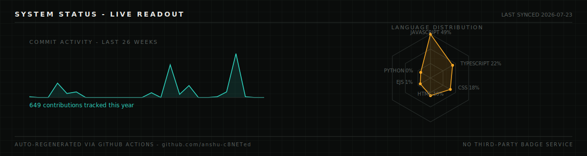
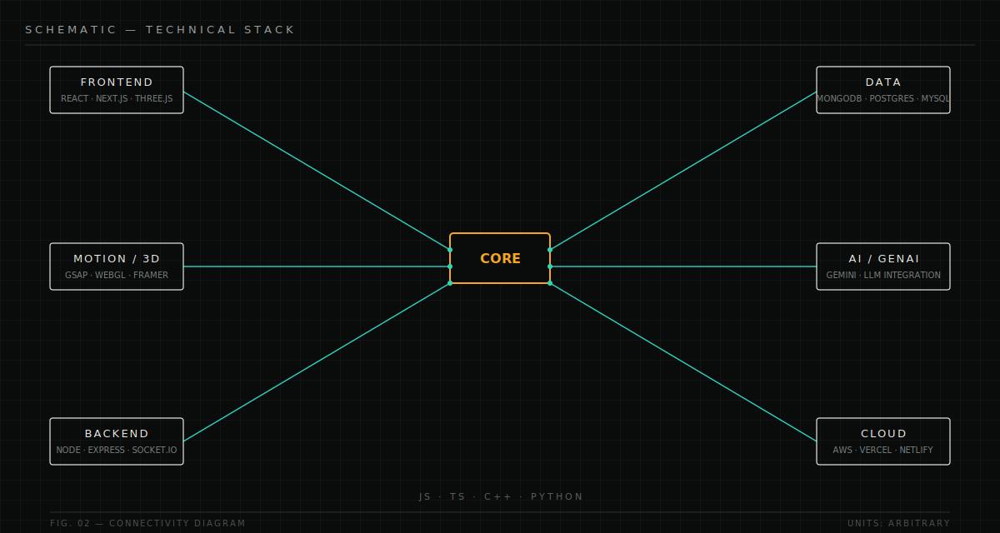
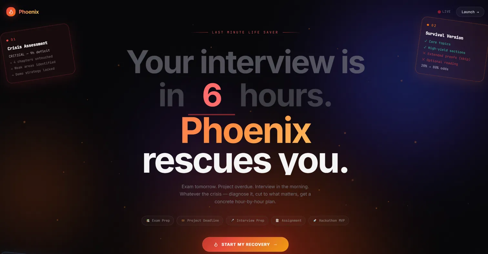
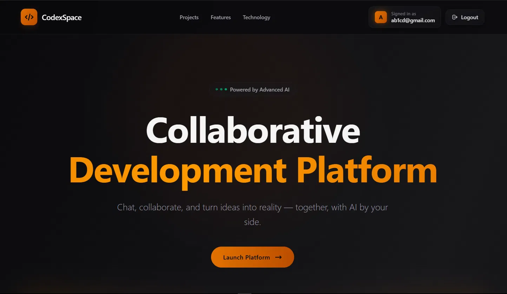
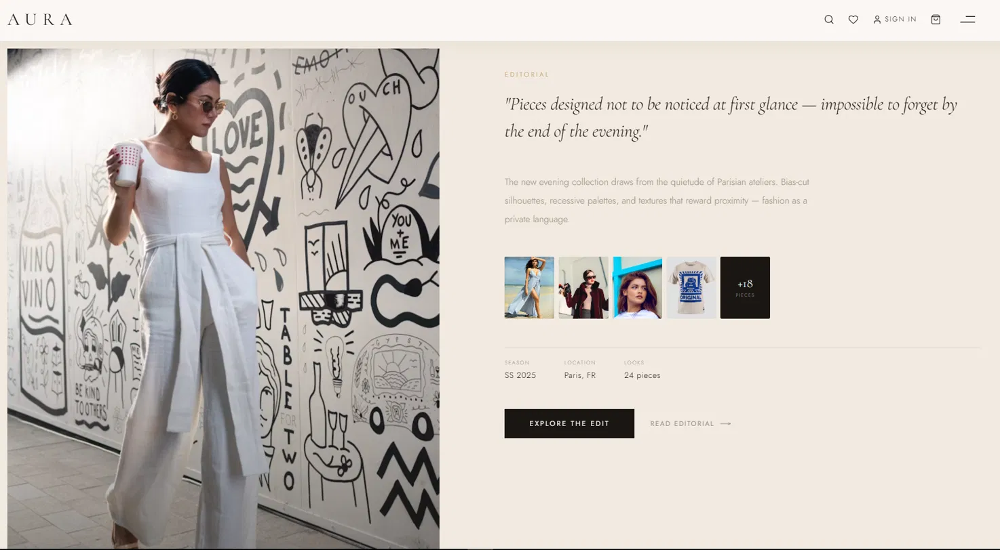
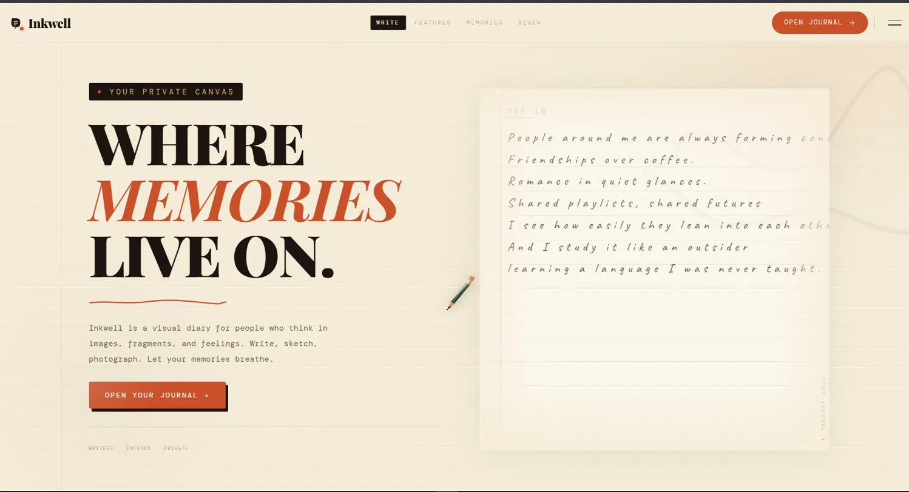

<div align="center">



</div>

<br/>

<table width="100%">
<tr>
<td width="70%" valign="top">

**Full-stack engineer working at the intersection of interface, motion and systems.** I build things that are fast to use and precise to look at — real-time collaborative tools, 3D web experiences, and AI-integrated products, shipped with the same attention to detail you'd expect from a piece of hardware documentation, not a portfolio site.

</td>
<td width="30%" valign="top" align="right">

[`PORTFOLIO`](https://portfolio-by-ar.vercel.app/) · [`LINKEDIN`](https://linkedin.com/in/anshu-raj-tech) · [`LEETCODE`](https://leetcode.com/u/anshxu) · [`EMAIL`](mailto:rajanshu2123@gmail.com)

</td>
</tr>
</table>

<br/>

## ⌁ SYSTEM STATUS

<sub>This panel is not a static badge. It's regenerated every 6 hours by a GitHub Action that pulls real commit and language data from this account and draws it from scratch — see <code>.github/workflows/generate-readout.yml</code>.</sub>



<br/>

## ⌁ SCHEMATIC



<br/>

## ⌁ BUILDS

<table width="100%">
<tr>
<td width="50%">

<br/>

**PHOENIX** — last-minute crisis tool for exams, interviews, deadlines and hackathons. Diagnoses what's actually critical, cuts non-essential material, and outputs a concrete hour-by-hour recovery plan with weighted survival odds.
`React` `AI Planning` · [Source](https://github.com/anshu-c8NETed](https://phoenix-647479600848.us-west1.run.app/))

</td>
<td width="50%">

<br/>

**CODEXSPACE** — real-time collaborative code editor with embedded AI. 50+ concurrent users, sub-100ms edit latency, WebContainer in-browser execution, Monaco editor.
`React` `Socket.io` `Gemini` `MongoDB` · [Source](https://github.com/anshu-c8NETed](https://codex-space-frontend.vercel.app/))

</td>
</tr>
<tr>
<td width="50%">

<br/>

**AURA** — editorial e-commerce concept for an evening-wear label. Bias-cut typography, gallery-style product reveal, and a layout built to read like a fashion magazine rather than a storefront.
`React` `Next.js` `Tailwind` · [Source](https://github.com/anshu-c8NETed)

</td>
<td width="50%">

<br/>

**INKWELL** — animated journaling app with a ghost-handwriting canvas, ink-trail custom cursor, 3D tilt journal cards, and a full hand-built design system (Playfair Display × Caveat × DM Mono).
`React` `GSAP` `Lenis` `Canvas API` · [Source](https://visual-diary-pink.vercel.app/) 

</td>
</tr>
</table>

<div align="center">

[`VIEW ALL 20+ REPOSITORIES →`](https://github.com/anshu-c8NETed?tab=repositories)

</div>

<br/>

## ⌁ LOG

```yaml
problems_solved:        500+   # LeetCode, DSA
production_projects:    10+
concurrent_users_max:   50+    # CodexSpace stress test
certifications:
  - GenAI Powered Data Analytics — Tata iQ, Forage
  - Front-End Software Engineering — Skyscanner, Forage
  - Vice President (Tech & Media) — PPGS, HIT
status: open to full-stack, real-time, 3D web, and GenAI-integration work
```

<br/>

<div align="center">
<sub>India · last revised 2026.06 · built without third-party badge generators</sub>
</div>
